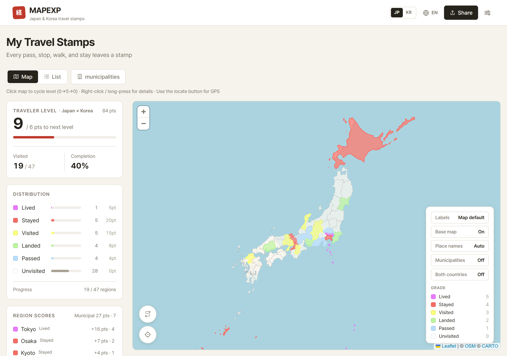
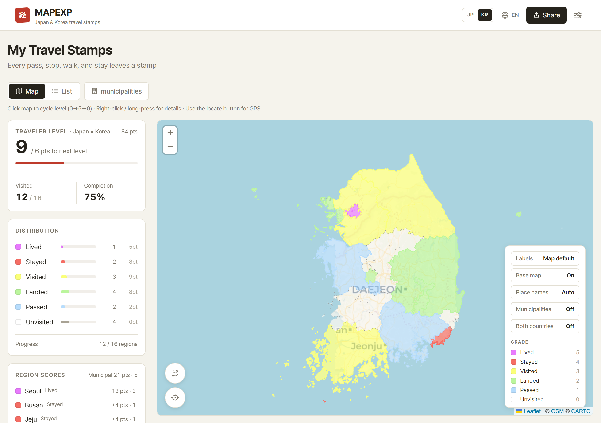
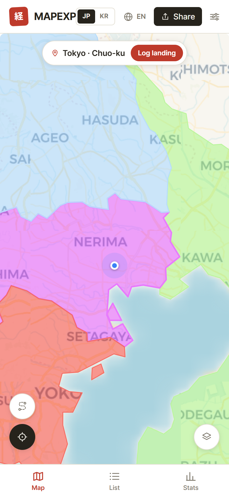
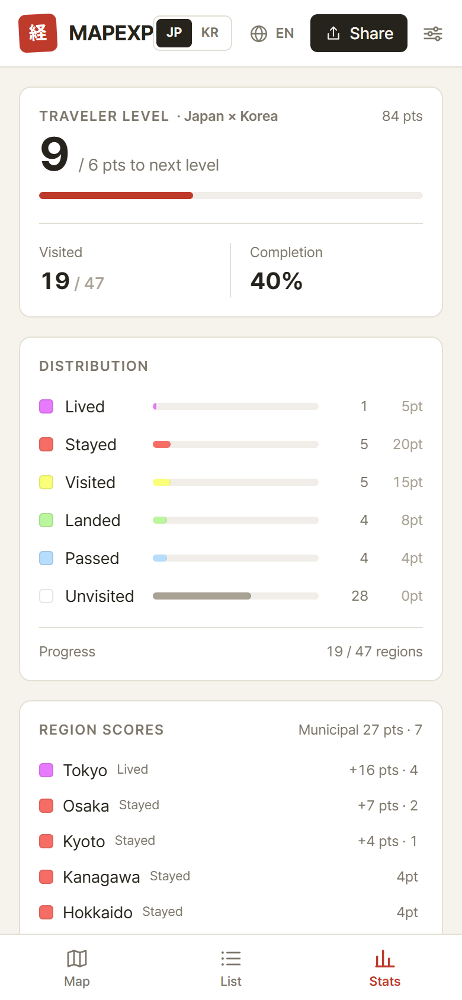
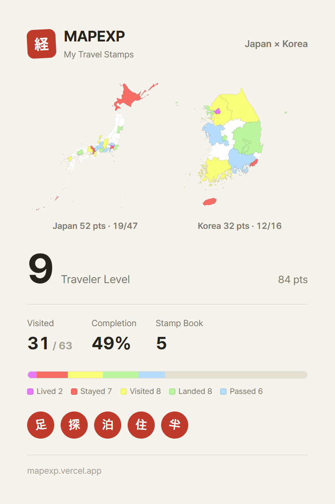

# MAPEXP — My Travel Stamps

[한국어](README.md) · **English** · [日本語](README.ja.md)

**▶ https://mapexp.vercel.app — no install, works right away**

A map that stamps every region you've traveled to, building up your travel footprint.
Records Japan's 47 prefectures & 1,897 municipalities and Korea's 16 provinces & 250 municipalities — **on one map**.

Based on Japan's [経県値 (Keikenchi)](https://uub.jp/kkn/) concept, reimagined with dual-country recording, municipality-level precision, and GPS stamping. The map uses the original Keikenchi standard color palette.

<p align="center">
  
</p>
<p align="center">
  
</p>

<p align="center">
  
  &nbsp;
  
  &nbsp;
  
</p>

## Features

- **Stamp records** — Tap a region to cycle its grade: Unvisited(0) → Passed(1) → Landed(2) → Visited(3) → Stayed(4) → Lived(5). Mis-taps can be undone from a toast; long-press opens details (memos, visit log)
- **Dual-country view** — Show Japan and Korea on one screen; your traveler level always combines both countries, with per-country stats
- **Municipality level** — Stamp individual municipalities in the stamping view (list or mini-map); a "Municipalities" toggle renders the whole country at municipal detail
- **Place names in 3 languages** — Japanese municipalities in Hangul and romaji (from official MIC readings), Korean municipalities in kanji + katakana. Map place-name language is selectable independently of the UI language
- **GPS** — Auto-detects your current region (province + municipality), records travel tracks, auto-logs visits
  - GPS-verified records can't be edited or deleted; manual records allow free past-date entry
- **Gamification** — Traveler level, kanji seal stamp book (12 badges), per-region and municipal score breakdowns
- **Sharing** — SNS image card (Japan / Korea / Both × Regions / Municipal / Both), native image-file sharing on mobile, read-only share links
- **i18n UI** — Korean · English · Japanese
- **PWA** — Home-screen install, offline map caching
- **Privacy** — All records and location data stay in your browser only (no server, no login)

## Tech Stack

Next.js 16 · React 19 · TypeScript · Tailwind CSS 4 · Leaflet (react-leaflet) · Zustand · Turf.js · d3-geo

## Development

```bash
npm install
npm run dev    # http://localhost:3000
npm run build  # production build

# Regenerate localized Japanese municipality names (public/geojson/jp-muni-names.json)
node scripts/gen-muni-names.mjs
```

## Data Sources

- Japan: [国土数値情報 N03](https://nlftp.mlit.go.jp/ksj/) (processed by [smartnews-smri/japan-topography](https://github.com/smartnews-smri/japan-topography)); municipality readings from the MIC local government codes ([nojimage/local-gov-code-jp](https://github.com/nojimage/local-gov-code-jp))
- Korea: KOSTAT administrative boundaries ([southkorea/southkorea-maps](https://github.com/southkorea/southkorea-maps)), reflecting the 2026-07 reorganization
- Base tiles: [CARTO](https://carto.com/attributions) / [OpenStreetMap](https://www.openstreetmap.org/copyright)

The 経県値Ⓡ (Keikenchi) concept originates from [都道府県市区町村 (uub.jp)](https://uub.jp/kkn/). 経県値 is a registered trademark of uub.jp.
