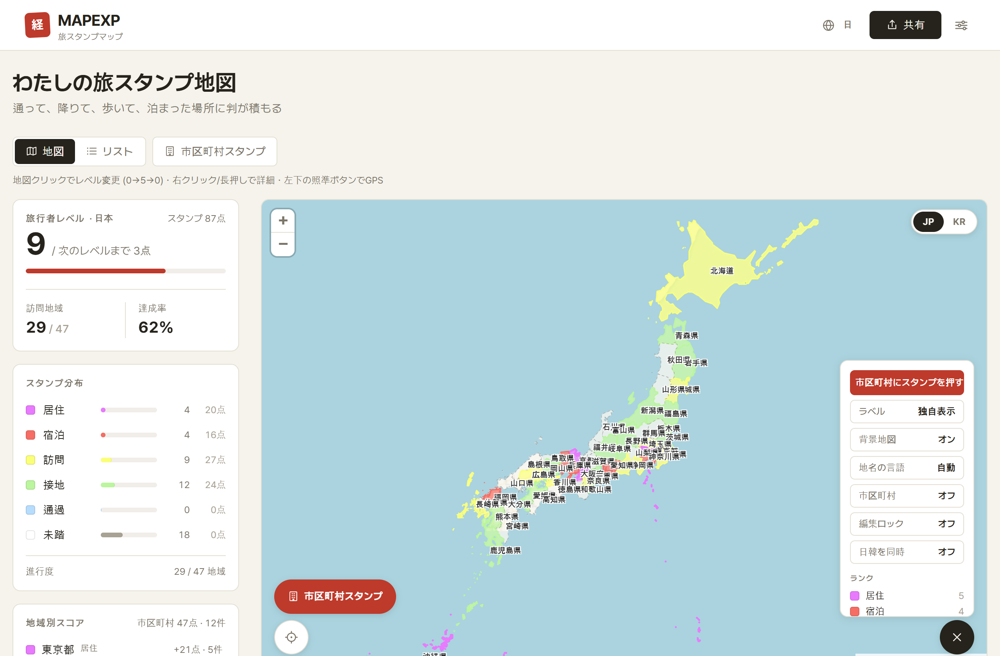
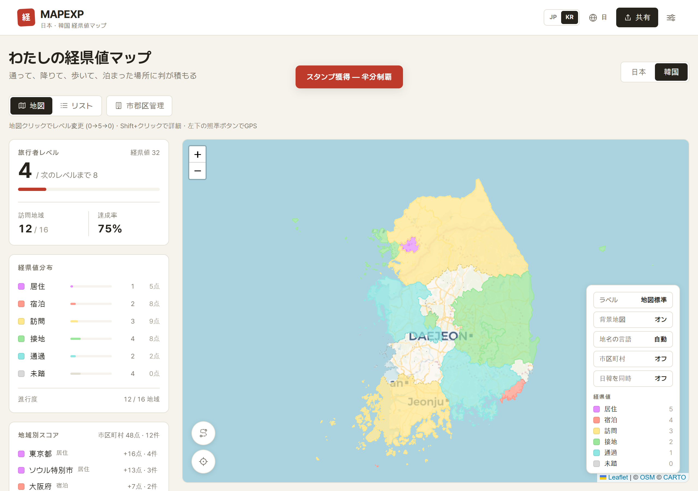
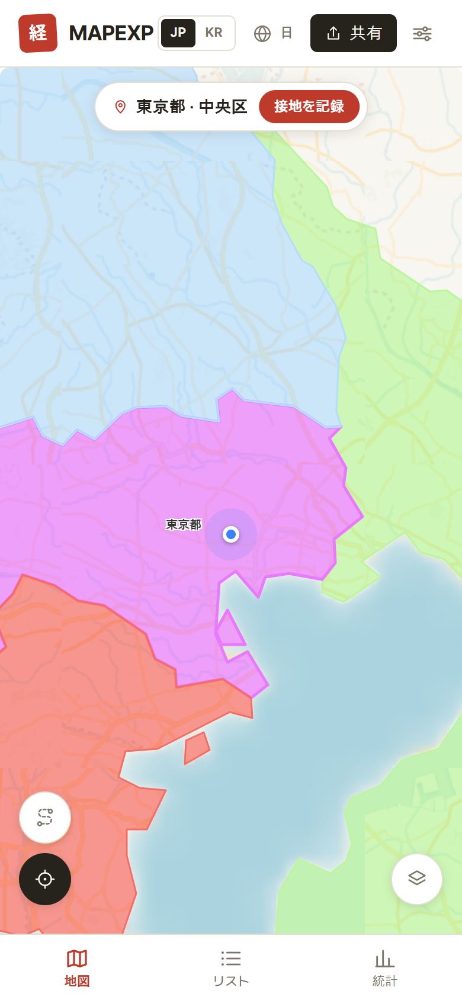
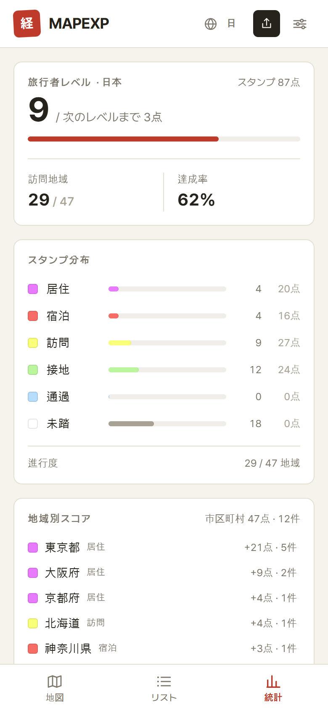
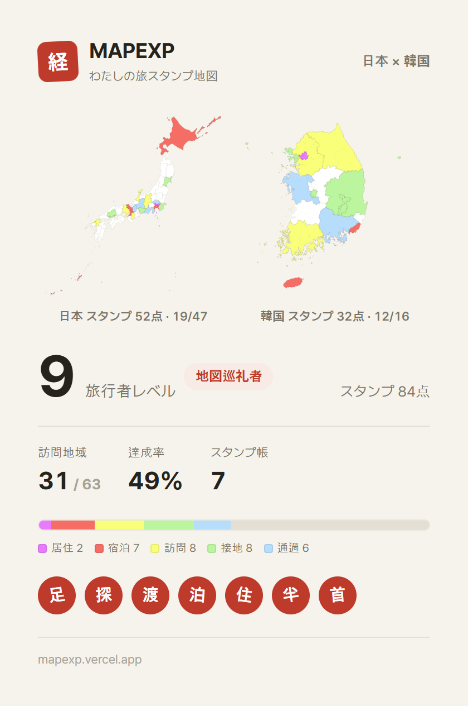

# MAPEXP — 旅スタンプ地図

[한국어](README.md) · [English](README.en.md) · **日本語**

**▶ https://mapexp.vercel.app — インストール不要ですぐ使えます**

訪れた地域ごとにスタンプを押して、旅の足あとを積み上げる地図サービス。
日本の47都道府県・1,897市区町村と、韓国の16道市・250市郡区を**ひとつの地図で**記録できます。

日本で親しまれている[経県値®](https://uub.jp/kkn/)（uub.jp）の考え方 — 通過1点〜居住5点の6段階評価 — をもとに、日韓両国の同時記録・市区町村単位の精度・GPSスタンプで再構成しました。地図の配色も経県値の標準カラーをそのまま採用しているので、経県値マップに親しんだ方ならひと目で読めます。

<p align="center">
  
</p>
<p align="center">
  
</p>

<p align="center">
  
  &nbsp;
  
  &nbsp;
  
</p>

## 主な機能

- **旅スタンプの記録** — 地域をタップするたびにランクが変化：未踏(0) → 通過(1) → 接地(2) → 訪問(3) → 宿泊(4) → 居住(5)。押し間違いはトーストから元に戻せて、長押しで詳細（メモ・訪問記録）
- **両国同時ビュー** — 日本と韓国の地図を一画面に表示、国別統計で記録（旅行者レベルは表示中の国に連動）
- **市区町村単位** — スタンプ画面（リスト・ミニマップ）で市区町村ごとに記録。「市区町村」トグルで全国を市区町村単位で表示
- **地名の3言語対応** — 日本の市区町村はハングル・ローマ字（総務省の読みに基づく）、韓国の市郡区は漢字＋カタカナで表示。地名の言語はUI言語とは別に選択可能
- **GPS現在地スタンプ** — ボタン一つで今いる地域（都道府県＋市区町村）を自動判定して押印。どちらの国にいても自動認識
  - GPS認証記録は作成後に日時の編集・削除ができません（手動記録は過去日付を自由に入力可）
- **ゲーム要素** — 旅行者レベル（国別）、漢字の落款スタンプ帳 — マイルストーン印と**地域制覇印**（一つの広域の全市区町村を訪問、または四国・全羅などの地方ブロック制覇で発行、藍色）、地域別スコア・市区町村スコアの統計
- **共有** — SNS画像カード（Lv・EXPのゲーム式スコア、ランク称号、地名ラベル・スタンプ帳の表示オプション、日本／韓国／両国 × 広域／市区町村）、地域別カードのプレビュー共有、QRコード、閲覧専用リンク、JSONファイル交換。受け取った地図は自分の記録と「自分のみ／相手のみ／両方」の3色で重ねて比較できます
- **多言語UI** — 한국어 · English · 日本語
- **PWA** — ホーム画面への追加、地図データのオフラインキャッシュ
- **プライバシー** — 記録と位置情報はすべて端末内にのみ保存（サーバー・ログインなし）

## 技術スタック

Next.js 16 · React 19 · TypeScript · Tailwind CSS 4 · Leaflet (react-leaflet) · Zustand · Turf.js · d3-geo

## 開発

```bash
npm install
npm run dev    # http://localhost:3000
npm run build  # 本番ビルド

# 日本の市区町村の多言語名データを再生成 (public/geojson/jp-muni-names.json)
node scripts/gen-muni-names.mjs
```

## データ出典

- 日本: [国土数値情報 N03](https://nlftp.mlit.go.jp/ksj/)（加工: [smartnews-smri/japan-topography](https://github.com/smartnews-smri/japan-topography)）、市区町村の読み: 総務省 全国地方公共団体コード（[nojimage/local-gov-code-jp](https://github.com/nojimage/local-gov-code-jp)）
- 韓国: 統計庁の行政区域（[southkorea/southkorea-maps](https://github.com/southkorea/southkorea-maps)）、2026年7月の再編を反映
- 背景タイル: [CARTO](https://carto.com/attributions) / [OpenStreetMap](https://www.openstreetmap.org/copyright)

「経県値Ⓡ」の概念元は[都道府県市区町村 (uub.jp)](https://uub.jp/kkn/) です。経県値は uub.jp の登録商標です。

## ライセンス

- **コード**: [MIT](LICENSE) © 2026 yabooung
- **地図データ**: 上記「データ出典」の各提供元のライセンスに従います（日本 国土数値情報の利用約款、韓国 統計庁・southkorea-maps、総務省コード等）。同梱の GeoJSON を再利用する際は原典の規約をご確認ください。
- **経県値Ⓡ** は uub.jp の登録商標であり、本プロジェクトは概念の参照・出典表記を目的とした指示的使用のみを行います。
