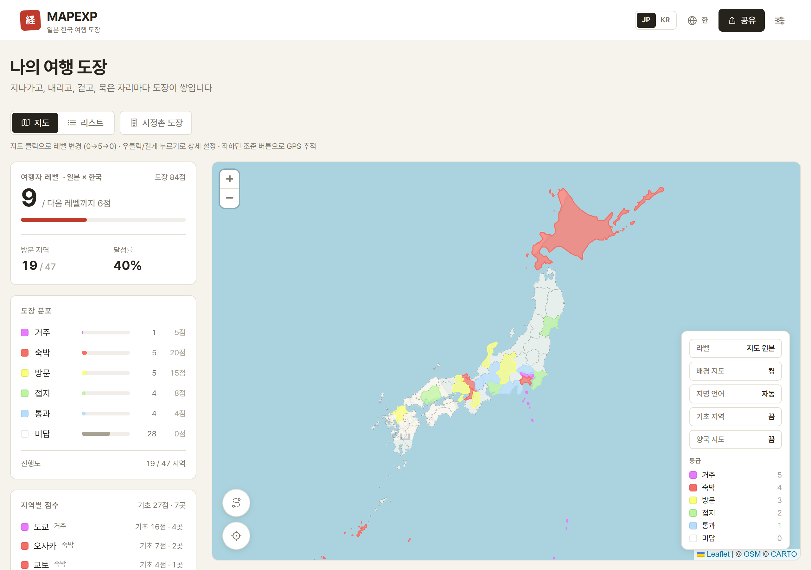
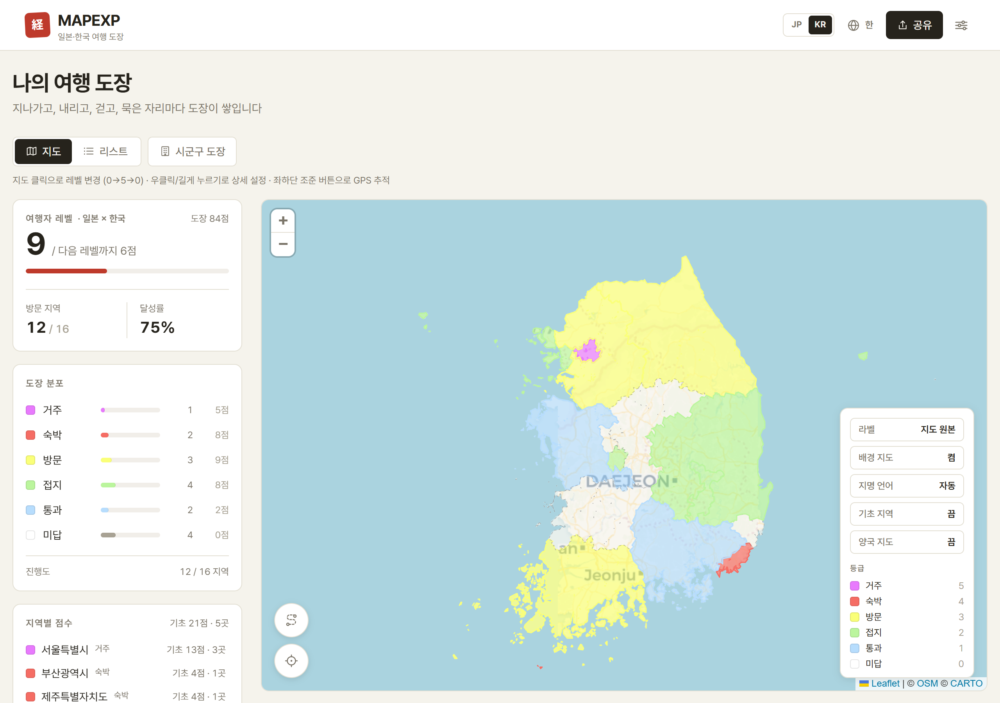
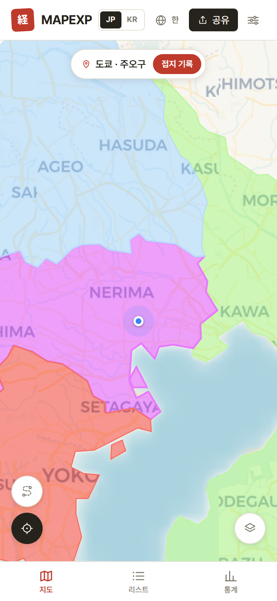
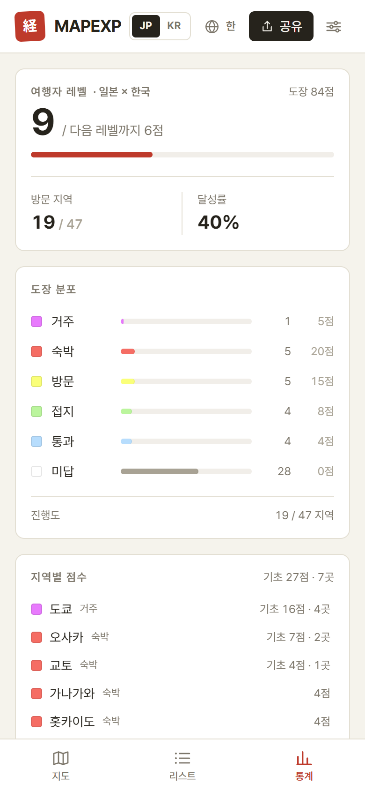
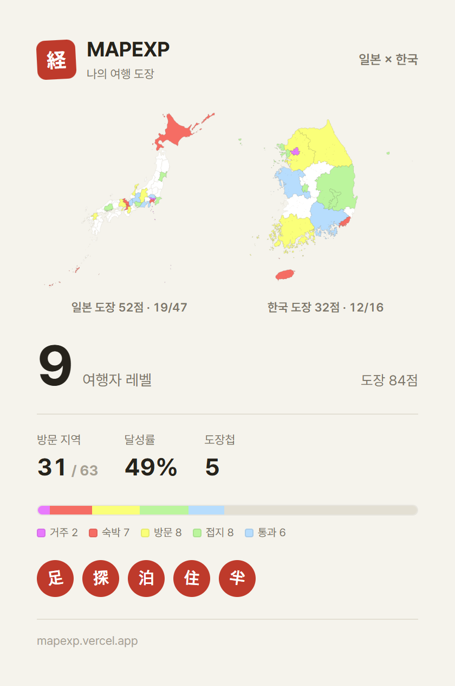

# MAPEXP — 나의 여행 도장

**한국어** · [English](README.en.md) · [日本語](README.ja.md)

**▶ https://mapexp.vercel.app — 설치 없이 바로 사용**

방문한 지역마다 도장을 찍어 여행 발자취를 쌓는 지도 서비스.
일본 47개 도도부현·1,897개 시정촌과 한국 16개 시도·250개 시군구를 **한 지도에서** 기록합니다.

일본의 [経県値](https://uub.jp/kkn/)(경현치) 개념을 바탕으로, 한일 양국 동시 기록·시정촌 정밀도·GPS 도장으로 재해석했습니다. 지도 색상은 経県値 원조 표준 팔레트를 그대로 사용합니다.

<p align="center">
  
</p>
<p align="center">
  
</p>

<p align="center">
  
  &nbsp;
  
  &nbsp;
  
</p>

## 주요 기능

- **도장 기록** — 지역을 탭할 때마다 등급 순환: 미답(0) → 통과(1) → 접지(2) → 방문(3) → 숙박(4) → 거주(5). 잘못 찍으면 토스트에서 바로 실행취소, 길게 누르면 상세(메모·방문 기록)
- **양국 동시 뷰** — 일본·한국 지도를 한 화면에 띄우고 양국 합산 여행자 레벨 + 국가별 통계로 기록
- **시정촌/시군구 단위** — 도장 찍기 화면(목록·미니맵)에서 기초 지역별 도장, '기초 지역' 토글로 전국을 시정촌 단위로 열람
- **지명 3개 언어** — 일본 시정촌은 한글·로마자 표기(총무성 읽기 기반), 한국 시군구는 한자+가타카나 표기. 지도 지명 언어는 UI 언어와 별도로 선택 가능
- **GPS** — 현재 지역(광역+기초 동시) 자동 감지, 이동 경로 트랙 기록, 자동 방문 감지
  - GPS 인증 기록은 생성 후 시간 수정·삭제 불가 (수동 기록은 과거 날짜 자유 입력)
- **게임화** — 여행자 레벨, 한자 낙관 도장첩(뱃지 12종), 지역별 점수·기초 점수 통계
- **공유** — SNS 이미지 카드(일본/한국/양국 × 광역/기초/둘다 선택), 모바일에서 이미지 파일 그대로 공유, 읽기 전용 공유 링크
- **다국어 UI** — 한국어 · English · 日本語
- **PWA** — 홈 화면 설치, 지도 데이터 오프라인 캐싱
- **프라이버시** — 모든 기록과 위치 정보는 사용자 브라우저에만 저장 (서버 없음, 로그인 없음)

## 기술 스택

Next.js 16 · React 19 · TypeScript · Tailwind CSS 4 · Leaflet(react-leaflet) · Zustand · Turf.js · d3-geo

## 개발

```bash
npm install
npm run dev    # http://localhost:3000
npm run build  # 프로덕션 빌드

# 일본 시정촌 다국어 이름 데이터 재생성 (public/geojson/jp-muni-names.json)
node scripts/gen-muni-names.mjs
```

## 데이터 출처

- 일본: [国土数値情報 N03](https://nlftp.mlit.go.jp/ksj/) (가공: [smartnews-smri/japan-topography](https://github.com/smartnews-smri/japan-topography)), 시정촌 읽기: 총무성 전국지방공공단체코드 ([nojimage/local-gov-code-jp](https://github.com/nojimage/local-gov-code-jp))
- 한국: 통계청 행정구역 ([southkorea/southkorea-maps](https://github.com/southkorea/southkorea-maps)), 2026-07 개편(전남광주통합특별시, 군위군 대구 편입) 반영
- 배경 타일: [CARTO](https://carto.com/attributions) / [OpenStreetMap](https://www.openstreetmap.org/copyright)

'경현치(経県値Ⓡ)' 개념 원조: [都道府県市区町村 (uub.jp)](https://uub.jp/kkn/) · 経県値는 uub.jp의 등록상표입니다.
